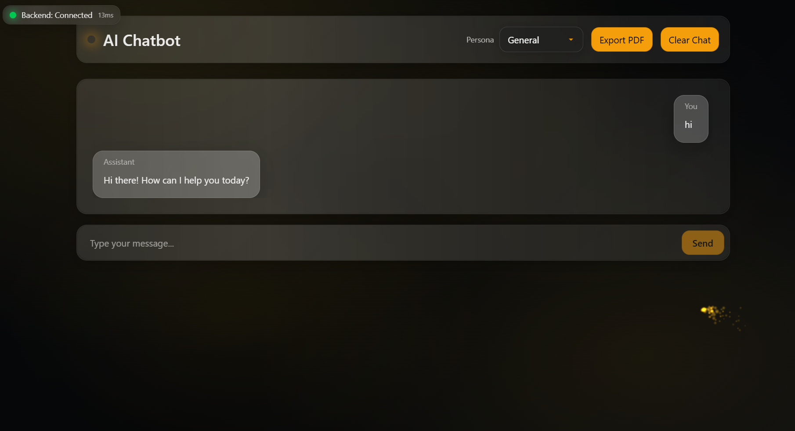
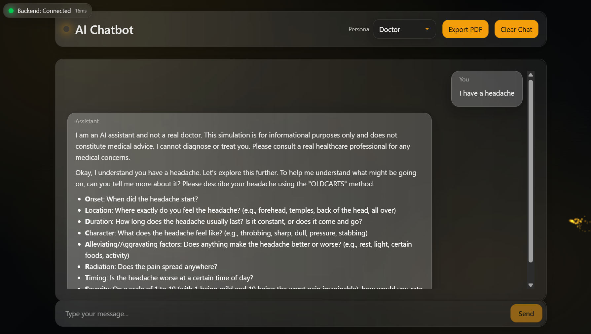
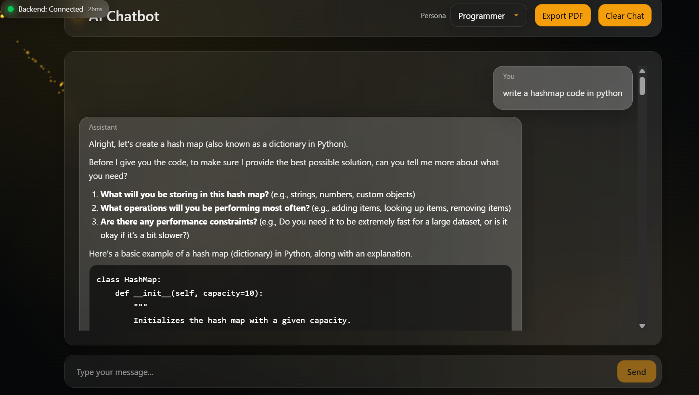
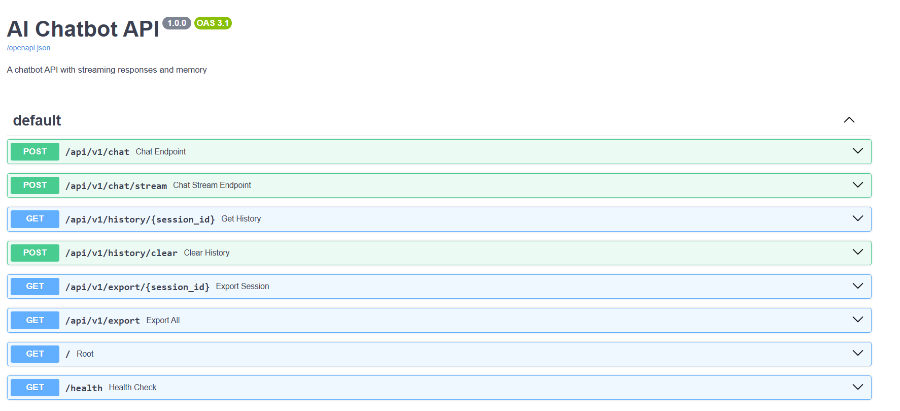

# AI Chatbot

A sophisticated chatbot backend with streaming responses, conversation memory, and Google Search grounding.

## 📺 Demo Video

Watch the demo video to see the AI Chatbot in action:

[](https://www.youtube.com/watch?v=L_0ikssVZBI)

[Watch on YouTube](https://www.youtube.com/watch?v=L_0ikssVZBI)

## 🖼️ Screenshots

### General Chat



### Doctor Mode



### Programmer Mode



### API Documentation



## Features

- **Streaming Responses**: Real-time token-by-token streaming via Server-Sent Events (SSE)
- **Conversation Memory**: Maintains chat history per session
- **Google Search Grounding**: Uses Google Search tool for accurate information
- **Multiple Roles**: Support for general, doctor, and programmer personas
- **REST API**: FastAPI with automatic OpenAPI documentation

## Quick Start

### 0. One-command start (recommended)

Use the provided entry scripts to set up and run both backend and frontend.

- Windows (PowerShell):
```powershell
Set-ExecutionPolicy Bypass -Scope Process -Force
./start.ps1
```

- macOS/Linux:
```bash
chmod +x start.sh
./start.sh
```

What the scripts do:
- Create/activate `.venv` if missing
- Install Python deps from `requirements.txt`
- Run `npm install` in `frontend` if needed
- Start backend (`python -m backend.run`) from the project folder and frontend (`npm run dev`) from the frontend folder in separate terminals

Prerequisites:
- Python 3.9+
- Node.js and npm
- `.env` with `GOOGLE_API_KEY` and `GEMINI_MODEL`

Troubleshooting:
- PowerShell script blocked → run `Set-ExecutionPolicy Bypass -Scope Process -Force`
- `start.sh` not executable → `chmod +x start.sh`
- Port conflicts → stop existing processes using ports 8000/5173

### 1. Install Dependencies

```bash
pip install -r requirements.txt
```

### 2. Set Up API Key

Create a `.env` file in the project root (both required):

```env
GOOGLE_API_KEY=your-google-api-key-here
GEMINI_MODEL=your-model-name
```

### 3. Run the Server

```bash
python -m backend.run
```

The API will be available at: `http://127.0.0.1:8000`

## API Endpoints

- **Documentation**: http://127.0.0.1:8000/docs
- **Health Check**: http://127.0.0.1:8000/health

### Available Endpoints

1. `POST /api/v1/chat` - Non-streaming chat
2. `POST /api/v1/chat/stream` - Streaming chat (SSE)
3. `GET /api/v1/history/{session_id}` - Get chat history
4. `POST /api/v1/history/clear` - Clear chat history

### Environment variables

- Backend
  - `GOOGLE_API_KEY` (required): obtain from `https://makersuite.google.com/app/apikey`.
  - `GEMINI_MODEL` (required): e.g. `gemini-1.5-flash` or `gemini-1.5-pro`.